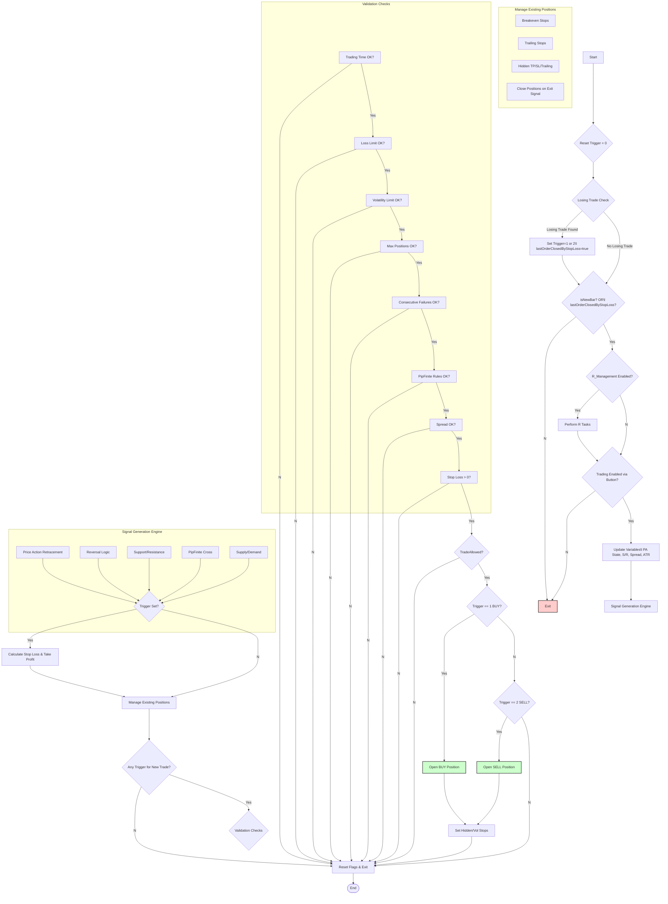

```mermaid
flowchart TD
    A[Start] --> B{Reset Trigger = 0}
    B --> C{Losing Trade Check}
    C --Losing Trade Found--> D[Set Trigger=1 or 2\l lastOrderClosedByStopLoss=true]
    C --No Losing Trade--> E
    D --> E
    E{isNewBar? OR\l lastOrderClosedByStopLoss?}
    E --No--> F[Exit]
    E --Yes--> G{R_Management Enabled?}
    G --Yes--> H[Perform R Tasks]
    G --No--> I
    H --> I
    I{Trading Enabled via Button?}
    I --No--> F
    I --Yes--> J[Update Variables\l PA State, S/R, Spread, ATR]
    
    J --> K[Signal Generation Engine]
    subgraph "Signal Generation Engine"
        K_PA[Price Action Retracement] --> K_SetTrigger
        K_Reversal[Reversal Logic] --> K_SetTrigger
        K_SR[Support/Resistance] --> K_SetTrigger
        K_PF[PipFinite Cross] --> K_SetTrigger
        K_SD[Supply/Demand] --> K_SetTrigger
    end
    
    K_SetTrigger{Trigger Set?}
    K_SetTrigger --Yes--> L[Calculate Stop Loss & Take Profit]
    K_SetTrigger --No--> M
    
    L --> M[Manage Existing Positions]
    subgraph "Manage Existing Positions"
        M_BE[Breakeven Stops]
        M_Trail[Trailing Stops]
        M_Hidden[Hidden TP/SL/Trailing]
        M_Exit[Close Positions on Exit Signal]
    end

    M --> N{Any Trigger for New Trade?}
    N --No--> Z[Reset Flags & Exit]
    N --Yes--> O{Validation Checks}

    subgraph "Validation Checks"
        O_Time[Trading Time OK?]
        O_Loss[Loss Limit OK?]
        O_Vol[Volatility Limit OK?]
        O_Max[Max Positions OK?]
        O_Fail[Consecutive Failures OK?]
        O_PipF[PipFinite Rules OK?]
        O_Spread[Spread OK?]
        O_SL[Stop Loss > 0?]
    end

    O_Time --No--> Z
    O_Time --Yes--> O_Loss
    O_Loss --No--> Z
    O_Loss --Yes--> O_Vol
    O_Vol --No--> Z
    O_Vol --Yes--> O_Max
    O_Max --No--> Z
    O_Max --Yes--> O_Fail
    O_Fail --No--> Z
    O_Fail --Yes--> O_PipF
    O_PipF --No--> Z
    O_PipF --Yes--> O_Spread
    O_Spread --No--> Z
    O_Spread --Yes--> O_SL
    O_SL --No--> Z
    O_SL --Yes--> P{TradeAllowed?}

    P --No--> Z
    P --Yes--> Q{Trigger == 1 BUY?}
    Q --Yes--> R[Open BUY Position]
    Q --No--> S{Trigger == 2 SELL?}
    S --Yes--> T[Open SELL Position]
    S --No--> Z
    R --> U[Set Hidden/Vol Stops]
    T --> U
    U --> Z

    Z --> End([End])

    style F fill:#ffcccc,stroke:#333,stroke-width:2px
    style R fill:#ccffcc,stroke:#333,stroke-width:2px
    style T fill:#ccffcc,stroke:#333,stroke-width:2px
```